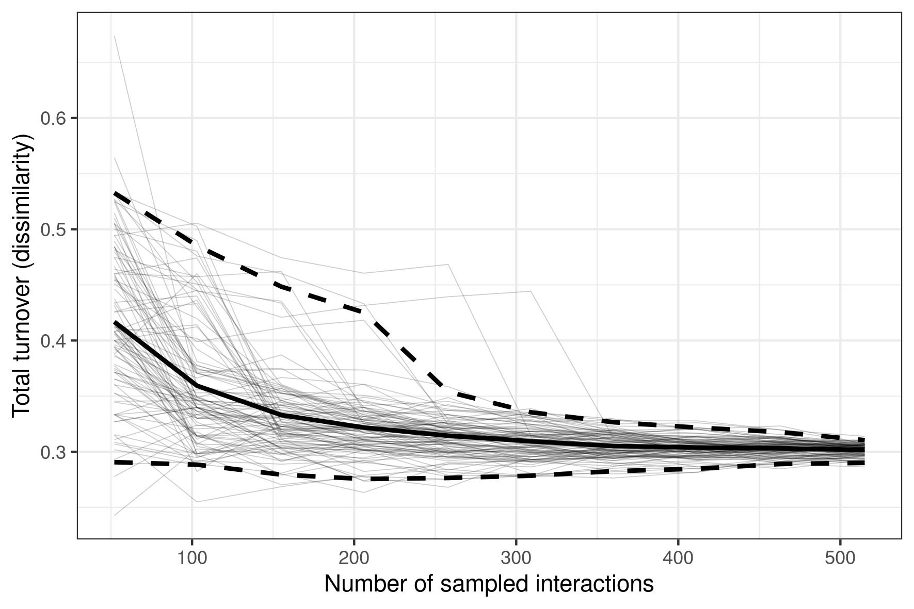

# bootdissim

## Overview

R package for building turnover saturation (rarefaction or accumulation) curves via bootstrapping. It offers a workflow to bootstrap dissimilarity metrics between ecological networks.

In the case of bipartite networks (e.g. plant - pollinator), such curves are informative about the level of effort still needed for collecting data to the point of having a trusted turnover estimate.

## Installation

You can install `bootdissim` from GitHub with:

``` r
# install.packages("devtools")
devtools::install_github("valentinitnelav/bootdissim")
```

## Examples

Given two networks, like `vazarr` and `vazcer` from the `bipartite` package. One can compute the bootstrapped saturation curve of turnover (dissimilarity) between these two networks when looking at their interactions.

``` r
library(bootdissim)
library(bipartite)
library(ggplot2)

# Get the character vectors of interactions from each network
net1 <- reshape_net(vazarr, seed = 1)
net2 <- reshape_net(vazcer, seed = 1)
vect <- get_interactions(net1, net2)

# Can also compute the observed dissimilarity between the two vectors of
interactions. Several indices are implemented for now:
abc <- get_abc(vect)

get_beta(abc, "whittaker")
# [1] 0.2846473
get_beta(abc, "jaccard")
# [1] 0.5568475
get_beta(abc, "sorensen")
# [1] 0.7153527

# Bootstrapp (resample) the dissimilarity:
dism_boot <- boot_dissim(lst_vect = vect,
                         index = "whittaker",
                         by = 50,
                         replace = FALSE,
                         size_short = TRUE,
                         n_boot = 100,
                         n_cpu = 3)

# Plot the saturation curve
p <- plot_dissim(get_stats_gg(dism_boot))
p <- p + labs(x = "Number of sampled interactions",
              y = "Total turnover (dissimilarity)") +
  theme_bw()
p
```

<!--
ggsave(p, filename = "./man/cache/readme-example-1.png",
       units = "cm", width = 15, height = 10, dpi = 300)
-->


